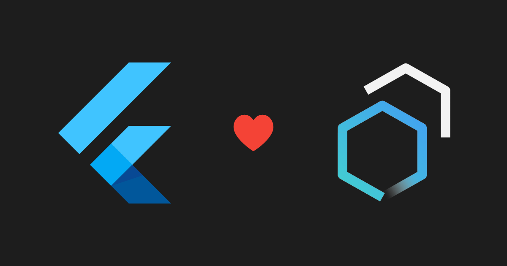
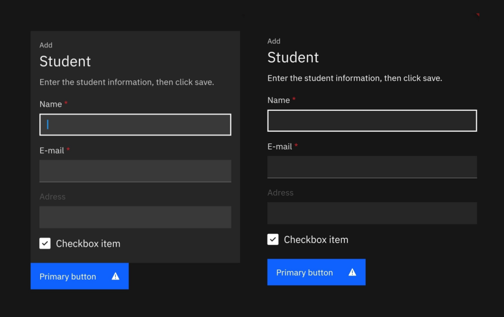
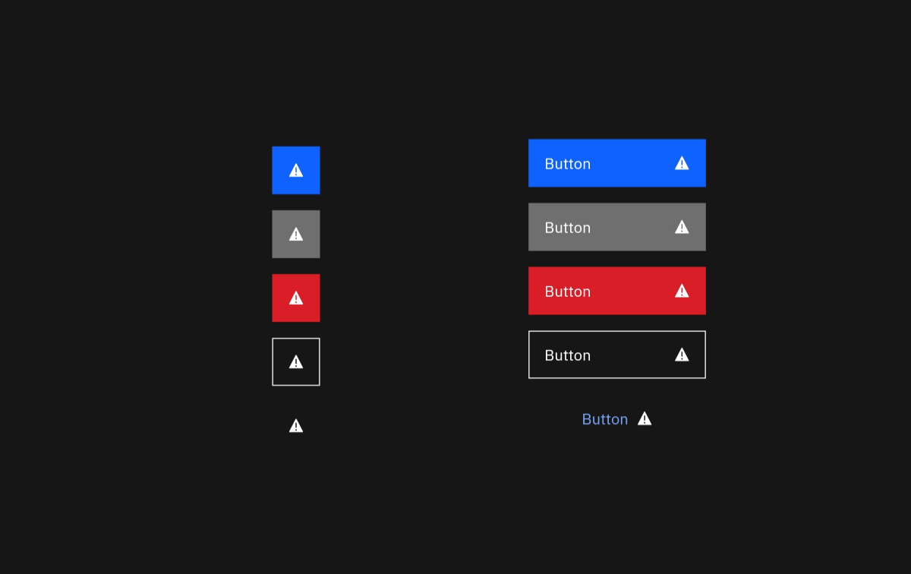

# Flutter Carbon

Unofficial implementation of Carbon Design System using Flutter framework



### Finished widgets

- [x] CButtons (primary, secondary, danger, tertiary, ghost)

- [x] CTextfield (primary, success , warning, danger) based on validation

- [x] CForm (form , form group)

- [x] CCheckbox

- [x] CSVGIcon

- [x] CLink

# Screenshots

### Form



### Button



# Setup project

Clone the repo:

```shell
git clone https://github.com/NourEldinShobier/carbon-flutter
```

Change directory to lab:

```shell
cd lab
```

Get flutter dependencies

```shell
flutter pub get
```
