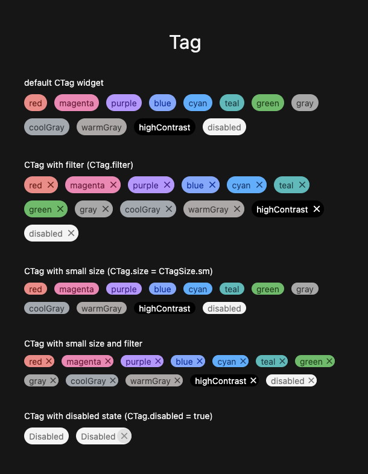

# Flutter Carbon

‌Carbon is IBM’s **open-source** design system for products and experiences. With the IBM Design Language as its foundation, the system consists of working code, design tools and resources, human interface guidelines, and a vibrant community of contributors.

‌
The goals of the design system include improving UI consistency and quality, making the design and development process more efficient and focused, establishing a shared vocabulary between designer and developer, and providing clear, discoverable guidance around design and development best practices.

### Carbon Flutter 💎

**Flutter Carbon** is an unofficial implementation of Carbon Design System using Flutter framework. It provides Flutter developers a collection of widgets to build apps and user interfaces. Adopting the package enables developers to use consistent styles and behavior in prototype and production work.

# Documentation

The full documentation of the project can be found [here](https://nour-eldin-shobier.gitbook.io/carbon-flutter/)

## Screenshots

<h3 align='center'>Made with :heart: in Egypt</h3>
